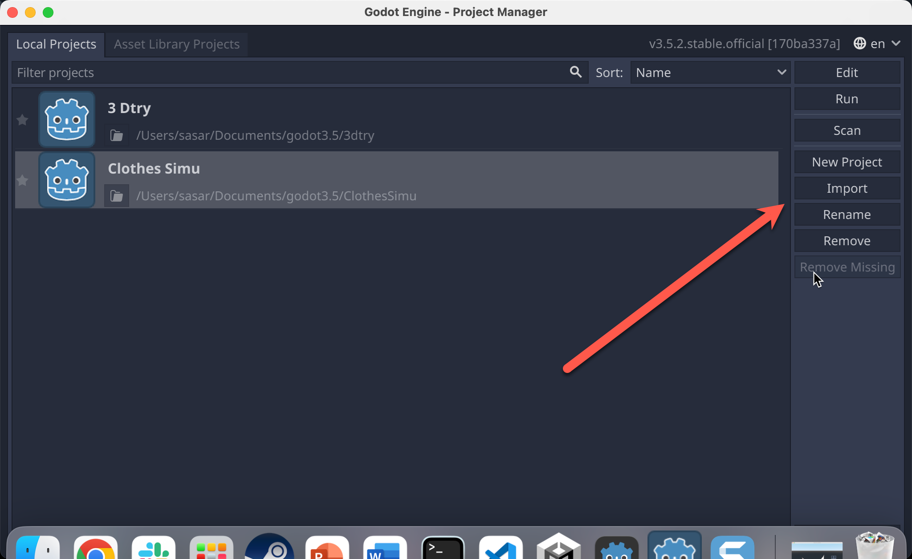
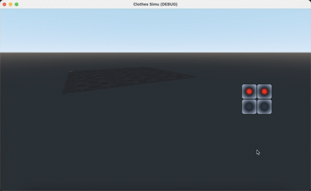
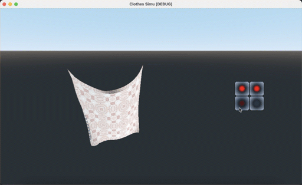

# CG_ClothSimu
### Usage  

Download godot 3.5  
https://github.com/godotengine/godot/releases/tag/3.5-stable  

Click import and put all the files into the path  
  

### Preview  
  

Click the buttons to change the fixed point  
  
